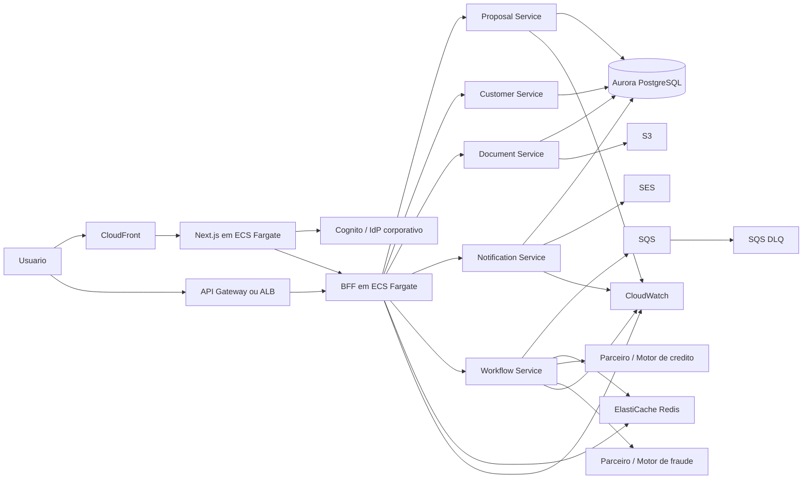

# Referencia de Arquitetura AWS

## Objetivo

Mostrar como os componentes usados no MVP local poderiam evoluir para uma implementacao real na AWS.

## Principio

No MVP usamos componentes simples e locais para validar a espinha dorsal do fluxo.

Em uma implementacao real na AWS, a ideia nao e copiar literalmente cada ferramenta local, mas preservar a responsabilidade de cada bloco com servicos gerenciados equivalentes.

---

## Mapeamento direto

| MVP local | Papel no sistema | AWS recomendada |
| --- | --- | --- |
| `apps/web` em Next.js | portal operacional / jornada do usuario | `CloudFront + ECS Fargate` para SSR, ou `Amplify Hosting` se o uso permitir |
| `mock-oidc` | provedor de identidade local | `Amazon Cognito` federado com IdP corporativo |
| `services/bff` | agregacao e camada de borda | `ECS Fargate` atras de `ALB`, opcionalmente com `API Gateway` na borda |
| `proposal`, `customer`, `document`, `notification`, `workflow` | servicos de negocio | `ECS Fargate` por servico, em subnets privadas |
| `credit-analysis`, `fraud-analysis` simulados | parceiros ou motores externos | integracoes com APIs externas ou servicos internos dedicados em `ECS/Lambda` |
| `PostgreSQL` | persistencia transacional | `Amazon Aurora PostgreSQL` ou `RDS PostgreSQL` |
| `Redis` para fila, dedupe e rate limit | apoio operacional e assicronia | `SQS` para fila e DLQ, `ElastiCache Redis` para dedupe e rate limit |
| `MinIO` | storage de documentos | `Amazon S3` |
| `Mailpit` | validacao local de e-mail | `Amazon SES` |
| logs JSON locais | observabilidade basica | `CloudWatch Logs` |
| `/metrics` locais | metricas operacionais | `CloudWatch Metrics`, opcionalmente `Amazon Managed Prometheus` + `Grafana` |
| secrets via env / file | configuracao sensivel | `AWS Secrets Manager` e `SSM Parameter Store` |
| Docker Compose | ambiente local integrado | `Terraform` + pipelines de deploy |

---

## Desenho recomendado na AWS

---

## Decisoes sugeridas

## 1. Containers em ECS Fargate

### Por que faz sentido aqui

- o MVP ja esta empacotado em containers;
- reduz overhead operacional comparado a Kubernetes para esse contexto;
- separa servicos por responsabilidade sem exigir gestao de nodes;
- encaixa bem para `web`, `bff` e servicos Go.

## 2. Aurora PostgreSQL

### Por que faz sentido aqui

- mantem compatibilidade com o modelo relacional atual;
- melhora disponibilidade e operacao em comparacao ao banco local;
- e um caminho natural para dominios transacionais.

## 3. S3 no lugar de MinIO

### Por que faz sentido aqui

- storage nativo e duravel;
- permite URLs pre-assinadas;
- integra bem com eventos, lifecycle e politicas de seguranca.

## 4. SQS no lugar da fila local/Redis

### Por que faz sentido aqui

- separa claramente a responsabilidade de mensageria;
- suporta retry e DLQ de forma nativa;
- reduz acoplamento do workflow com a infraestrutura de fila.

## 5. ElastiCache Redis apenas para o que continua sendo Redis-like

### Manter Redis para

- deduplicacao de webhooks;
- rate limit por rota/parceiro;
- caches operacionais curtos.

### Nao usar Redis para

- fila principal de negocio, se `SQS` resolver melhor.

## 6. Cognito no lugar do mock OIDC

### Por que faz sentido aqui

- permite fluxo OIDC/OAuth gerenciado;
- integra com federacao corporativa;
- reduz o custo de manter identidade propria no projeto.

## 7. SES no lugar de Mailpit

### Por que faz sentido aqui

- entrega real de e-mails;
- reputacao, dominio e observabilidade de envio;
- substitui apenas a camada de desenvolvimento local.

---

## O que muda na arquitetura real

## O que permanece

- separacao por dominios;
- BFF como camada de agregacao;
- workflow assincrono;
- callbacks externos autenticados;
- auditoria, dedupe e rate limit;
- storage externo para documentos;
- banco relacional para entidades core.

## O que muda

- `MinIO` vira `S3`;
- `Mailpit` vira `SES`;
- `mock-oidc` vira `Cognito` ou IdP corporativo;
- a fila principal sai de um mecanismo local e vai para `SQS`;
- observabilidade sai de endpoints locais e entra em stack de monitoramento AWS.

---

## Como explicar isso na apresentacao

### Frase curta

`No MVP usamos equivalentes locais para validar o desenho. Em AWS, mantemos a mesma separacao de responsabilidades, mas substituimos os componentes locais por servicos gerenciados com o mesmo papel arquitetural.`

### Frase curta

`Nao estamos propondo outra arquitetura. Estamos propondo a mesma arquitetura, em uma infraestrutura real e gerenciada.`

---

## Observacoes importantes

- para uma implementacao produtiva, vale revisar se o `workflow` continua como servico proprio ou evolui partes para `Step Functions`;
- `API Gateway + Lambda` pode ser uma alternativa para webhooks especificos, mas como ja temos um BFF consolidado em container, `ALB + ECS` tende a manter a coerencia do desenho atual;
- se o front depender fortemente de SSR, `ECS Fargate` tende a ser um encaixe mais direto do que uma hospedagem puramente estatica.
