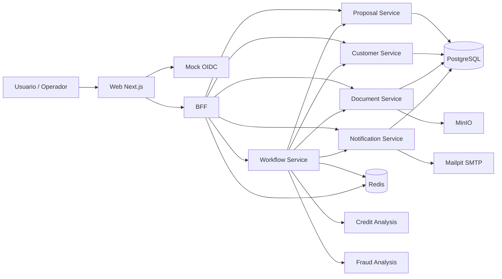

# Diagrama de Arquitetura do MVP

## Visao geral

## Leitura do diagrama

- o `web` e a interface do operador;
- o `mock-oidc` simula o provedor de identidade local;
- o `BFF` centraliza a entrada do front e agrega os dados da proposta;
- os servicos de dominio foram separados por contexto: proposta, cliente, documento e notificacao;
- o `workflow` coordena o processamento assincrono das analises;
- `credit-analysis` e `fraud-analysis` representam parceiros simulados;
- `Redis` suporta fila, deduplicacao e rate limit;
- `PostgreSQL` persiste os dados transacionais;
- `MinIO` armazena os documentos;
- `Mailpit` recebe os e-mails simulados.

## Mensagem para apresentacao

`O front nao conversa diretamente com todos os servicos. Ele fala com o BFF, que agrega a jornada. O workflow tira as analises do caminho sincrono, enquanto Redis, PostgreSQL, MinIO e Mailpit suportam operacao local realista para o MVP.`
